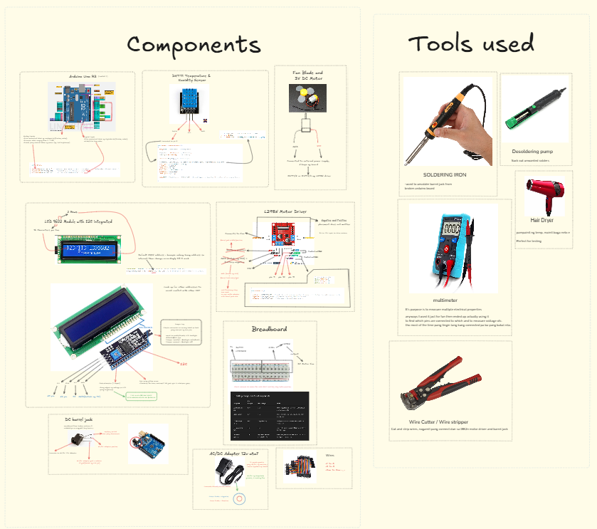
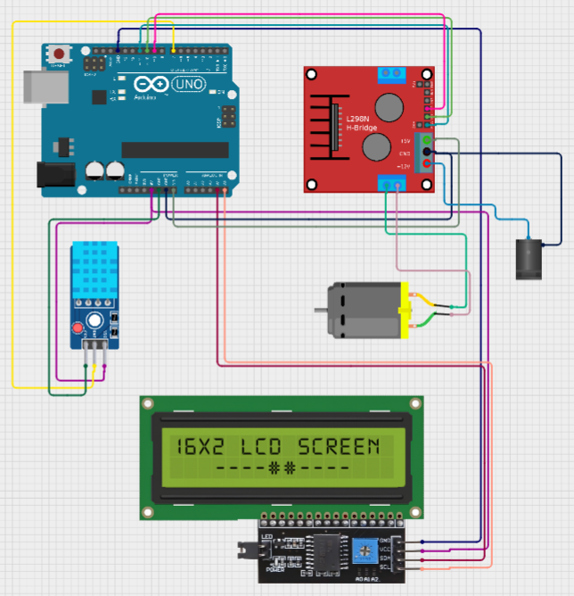

# Automatic Air Cooling System

This project demonstrates an **Automatic Cooling System** that monitors environmental conditions using a DHT11 (Temperature & Humidity Sensor) and controls a cooling device (fan) based on predefined thresholds. The system displays real-time data on an LCD screen and is implemented using an Arduino Uno board.

### Key Features

- Real-time monitoring of temperature (°C) and humidity (%)
- Automatic activation of a cooling fan when temperature exceeds a set limit
- Visual feedback via 16x2 LCD display

## Design and Simulation

To ensure proper planning and functionality before hardware implementation, the system was first designed and simulated using 🧩 Excalidraw and 🔌 Cirkit Designer IDE.

- [View Components and Tools on Excalidraw](https://excalidraw.com/#json=T8eYGZ_G5rBrMS9Pw7xmF,g7ilHSQm3LCfrJ7kfb9kOQ)

&nbsp;

- [Open Circuit Design](https://excalidraw.com/#json=T8eYGZ_G5rBrMS9Pw7xmF,g7ilHSQm3LCfrJ7kfb9kOQ)

## References

- [Arduino Documentation](https://docs.arduino.cc/learn/starting-guide/getting-started-arduino/)
- [DHT11–Temperature and Humidity Sensor](https://components101.com/sensors/dht11-temperature-sensor)
- [LiquidCrystal_I2C Library Guide](https://docs.arduino.cc/libraries/liquidcrystal-i2c/)
